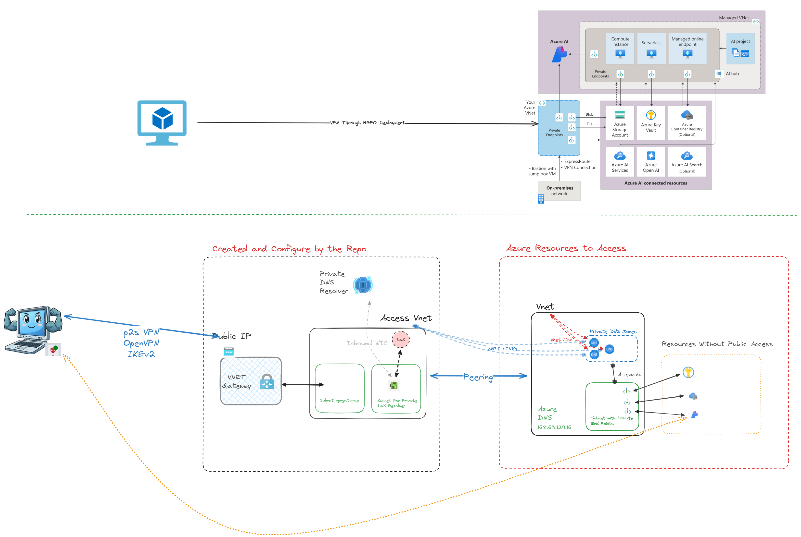

# Secure Azure Connection

>[!CAUTION]
>THIS IS A WORK IN PROGRESS.

## Overview

The **Secure Azure Connection** project provides a comprehensive solution to deploy a Point-to-Site (P2S) VPN in Azure. This setup includes a private DNS resolver and scripts to connect the solution with other "hub" Virtual Networks (VNets), enabling VPN clients to interact seamlessly with Azure resources.



## Video Tutorial/Explanation

For a step-by-step guide on how to deploy and configure the **Secure Azure Connection** project, you can watch the following YouTube video:

[](https://www.youtube.com/watch?v=AwIKgRl4E88)

This video provides detailed instructions on setting up the project, configuring the VPN, and resolving common issues.

## Benefits

- **Direct Connection:** Allows developers to connect directly from their desktops to Azure resources without needing to set up a VM and manage it through Intune.
- **Simplified DNS Management:** Users do not need to modify hosts files as private endpoint resolution is handled within the VPN.
- **Enhanced Security:** Ensures secure communication between on-premises machines and Azure resources through a secure P2S VPN connection.

## Features

- **VNet Deployment:** Deploys a Virtual Network (VNet) with two subnets:
  - One subnet for VPN clients.
  - One subnet for the private DNS resolver.
- **Hub VNet Connectivity:** Includes scripts for connecting the solution with other "hub" VNets.
- **Bicep Templates:** Provides Bicep templates for resource deployment.
- **Deployment Scripts:** Includes scripts to facilitate the deployment process.

## Deployment Instructions

1. **Clone the Repository:**

   ```bash
   git clone https://github.com/jsburckhardt/secure-azure-connection.git
   cd secure-azure-connection
   ```

2. **Configure Azure CLI:**

   Ensure you are logged into your Azure account:

   ```bash
   az login
   ```

3. **Deploy the Bicep Templates:**

   Execute the deployment script to deploy the resources:

   ```bash
   make deploy PREFIX=vpnaisv1
   ```

4. **Create the VNET links for your private dns zones**

   Update the `src/infra/linkConfig.json` file with the correct values for your `vpn` vnet.

   ```json
   {
     "links": [
         {
            "name": "vpn-link-blob",
            "dnsZoneName": "privatelink.blob.core.windows.net",
            "networkLinkVpnName": "vpn-st-blob-link-vpn"
         },
         {
            "name": "vpn-link-file",
            "dnsZoneName": "privatelink.file.core.windows.net",
            "networkLinkVpnName": "vpn-st-file-link-vpn"
         }
     ]
   }
   ```

   Then run the following command to create the links:

   ```bash
   make links
   ```

5. **Run VNET configuration script**

   The vnet configuration script is in charge of configuring the VNET with the DNS settings and configuring the peering.

   First create a copy of the `sample.env` file and configure your `.env` file with the correct values.

   ```bash
   make configure
   ```

6. **Configure VPN**

   TODO: steps
      - create self-sign cert
      - get public key for CA
      - configure p2s vpn with openvpn and IKEv2
      - add cert
      - download client

## Issues

- currently the **azure vpn config** is not pulling all the CAs you add into the configuration. Here is a video on how to fix it [link](https://youtu.be/0KiSMfP3iGw?si=pQ_ZMX82Fgc2seEh)
