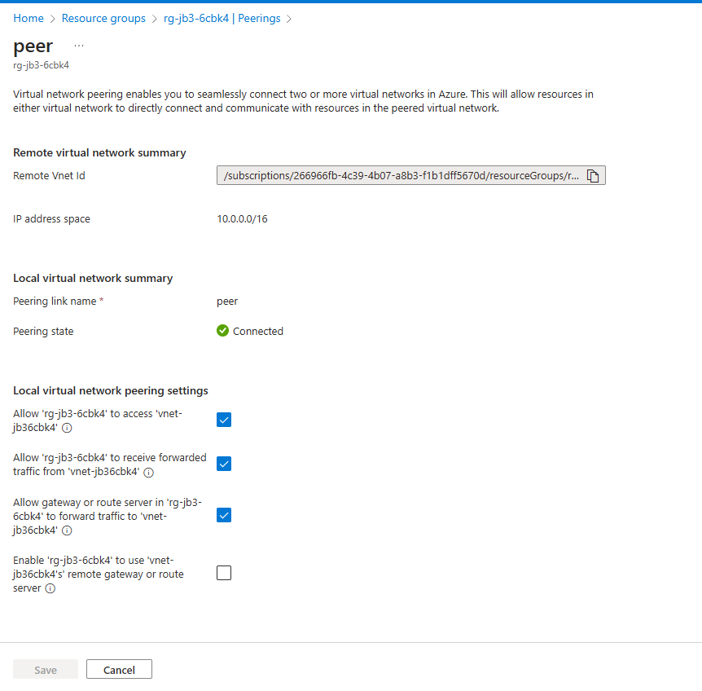
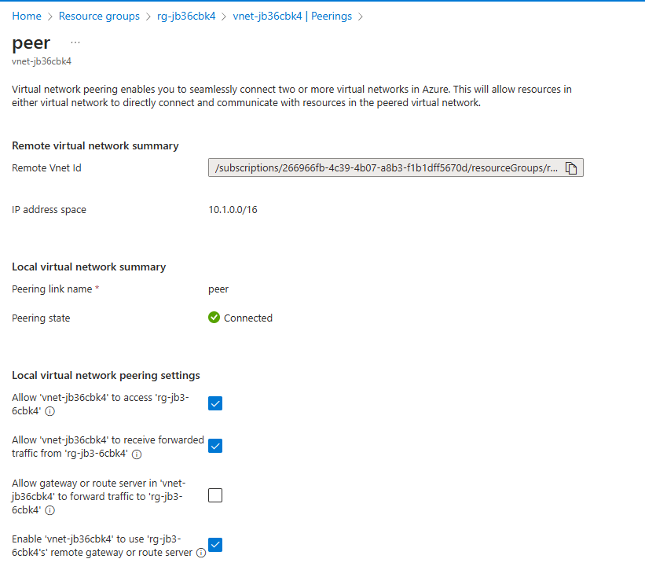

# Secure Azure Connection

## Overview

The **Secure Azure Connection** project provides a comprehensive solution to deploy a Point-to-Site (P2S) VPN in Azure. This setup includes a private DNS resolver and scripts to connect the solution with other "hub" Virtual Networks (VNets), enabling VPN clients to interact seamlessly with Azure resources.

## Benefits

- **Direct Connection:** Allows developers to connect directly from their desktops to Azure resources without needing to set up a VM and manage it through Intune.
- **Simplified DNS Management:** Users do not need to modify hosts files as private endpoint resolution is handled within the VPN.
- **Enhanced Security:** Ensures secure communication between on-premises machines and Azure resources through a secure P2S VPN connection.

## Features

- **VNet Deployment:** Deploys a Virtual Network (VNet) with two subnets:
  - One subnet for VPN clients.
  - One subnet for the private DNS resolver.
- **Hub VNet Connectivity:** Includes scripts for connecting the solution with other "hub" VNets.
- **Bicep Templates:** Provides Bicep templates for resource deployment.
- **Deployment Scripts:** Includes scripts to facilitate the deployment process.

## Flow to confgure

landing peer


resources hub


## Deployment Instructions

1. **Clone the Repository:**

   ```bash
   git clone https://github.com/your-repo/secure-azure-connection.git
   cd secure-azure-connection
   ```

2. **Configure Azure CLI:**
   Ensure you are logged into your Azure account:

   ```bash
   az login
   ```

3. **Deploy the Bicep Templates:**
   Execute the deployment script to deploy the resources:

   ```bash
   ./deploy.sh
   ```

4. **Connect to the VPN:**
   Follow the provided instructions in the `vpn-setup` directory to configure your desktop to connect to the Azure P2S VPN.

5. **Verify DNS Resolution:**
   Ensure that your VPN clients can resolve private endpoints without modifying the hosts files.

## Repository Structure

- `bicep/`: Contains Bicep templates for deploying Azure resources.
- `scripts/`: Includes deployment and configuration scripts.
- `vpn-setup/`: Instructions and scripts for setting up the VPN on client machines.

## Contributing

We welcome contributions to enhance the Secure Azure Connection project. Please read our [Contributing Guidelines](CONTRIBUTING.md) for more information.

## License

This project is licensed under the MIT License. See the [LICENSE](LICENSE) file for details.

## Support

For any issues or questions, please open an issue in the [GitHub Issues](https://github.com/your-repo/secure-azure-connection/issues) section of the repository.
